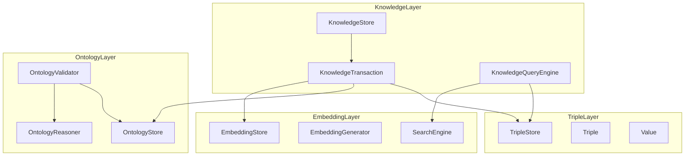

# fdb-knowledge-layer Architecture

**Version:** 0.1
**Date:** 2025-10-30
**Target:** Swift 6.0+, FoundationDB 7.1+

---

## Table of Contents

1. [Design Philosophy](#1-design-philosophy)
2. [System Architecture](#2-system-architecture)
3. [Data Model](#3-data-model)
4. [Layer Integration](#4-layer-integration)
5. [Transaction Management](#5-transaction-management)
6. [ODKE+ Knowledge Circulation](#6-odke-knowledge-circulation)
7. [Query Strategies](#7-query-strategies)
8. [Performance Considerations](#8-performance-considerations)

---

## 1. Design Philosophy

### 1.1 Core Principles

**fdb-knowledge-layer** is built on three fundamental principles:

#### Principle 1: Knowledge Unification

> "Knowledge is not just structure, semantics, or similarity—it is the **coherent integration** of all three."

Traditional approaches separate these concerns:
- RDF stores → Structure only
- Ontology systems → Semantics only
- Vector databases → Similarity only

We unify them in a **single transactional layer**.

#### Principle 2: ACID Consistency

> "Knowledge consistency requires **atomic validation** across all dimensions."

A knowledge assertion is only valid when:
- ✅ Structure is well-formed (Triple)
- ✅ Semantics are satisfied (Ontology)
- ✅ Embeddings are synchronized (Vector)

FoundationDB's ACID transactions make this possible.

#### Principle 3: Self-Evolving Knowledge

> "Knowledge systems must support **continuous regeneration** through feedback loops."

Inspired by Apple's ODKE+ research, knowledge is:
- Extracted (LLM)
- Validated (Ontology)
- Stored (Triple + Embedding)
- Retrieved (Hybrid Search)
- Regenerated (Feedback)

---

### 1.2 Why Not RDF?

Traditional RDF triple stores have limitations for modern knowledge extraction:

| Aspect | RDF Approach | Our Approach |
|--------|--------------|--------------|
| **Structure** | URI-centric, rigid | Value-flexible (6 types) |
| **Semantics** | OWL/RDFS external | Integrated OntologyStore |
| **Similarity** | Not supported | Native EmbeddingStore |
| **Consistency** | External validation | ACID transactions |
| **Query** | SPARQL (complex) | Swift-native API |
| **Evolution** | Static | ODKE+ circulation |

---

## 2. System Architecture

### 2.1 Layered Architecture

```
┌───────────────────────────────────────────────────────────┐
│                   Application Layer                       │
│               (Your Swift Application)                    │
└───────────────────────┬───────────────────────────────────┘
                        │
┌───────────────────────▼───────────────────────────────────┐
│              fdb-knowledge-layer (v0.1)                   │
│  ┌─────────────────────────────────────────────────────┐  │
│  │          KnowledgeStore (Public API)                │  │
│  │  - insert() / query() / delete()                    │  │
│  │  - findSimilar() / validate()                       │  │
│  └──────────────────┬──────────────────────────────────┘  │
│                     │                                     │
│  ┌──────────────────▼──────────────────────────────────┐  │
│  │       KnowledgeTransaction (Internal)               │  │
│  │  - Coordinates 3-layer operations                   │  │
│  │  - Ensures ACID consistency                         │  │
│  └──────┬────────────────┬────────────────┬────────────┘  │
│         │                │                │               │
│  ┌──────▼──────┐  ┌─────▼─────┐  ┌───────▼──────┐       │
│  │TripleStore  │  │Ontology   │  │Embedding     │       │
│  │(Structure)  │  │Store      │  │Store         │       │
│  │             │  │(Semantics)│  │(Similarity)  │       │
│  └─────────────┘  └───────────┘  └──────────────┘       │
└───────────────────────────────────────────────────────────┘
                        │
                ┌───────▼────────┐
                │  FoundationDB  │
                │   (ACID Layer) │
                └────────────────┘
```

### 2.2 Component Responsibilities

| Component | Responsibility | Actor | Package |
|-----------|----------------|-------|---------|
| **KnowledgeStore** | Public API, orchestration | ✅ | KnowledgeLayer |
| **KnowledgeTransaction** | Transaction coordination | ✅ | KnowledgeLayer |
| **KnowledgeQueryEngine** | Hybrid search execution | ✅ | KnowledgeLayer |
| **KnowledgeLoop** | ODKE+ circulation control | ✅ | KnowledgeLayer |
| **TripleStore** | SPO storage & retrieval | ✅ | TripleLayer |
| **OntologyStore** | Class/Predicate management | ✅ | OntologyLayer |
| **OntologyValidator** | Constraint validation | ✅ | OntologyLayer |
| **EmbeddingStore** | Vector persistence | ✅ | EmbeddingLayer |
| **EmbeddingGenerator** | Vector generation (MLX) | ❌ Protocol | EmbeddingLayer |

---

## 3. Data Model

### 3.1 KnowledgeRecord

The **unified knowledge representation** integrating all three layers:

```swift
public struct KnowledgeRecord: Codable, Hashable, Sendable {
    // Identity
    public let id: UUID

    // Triple (Structure)
    public let subject: Value
    public let predicate: Value
    public let object: Value
    public let tripleMetadata: Metadata?

    // Ontology (Semantics)
    public let subjectClass: String?
    public let objectClass: String?

    // Embedding (Similarity)
    public let embeddingID: String?
    public let embeddingModel: String?

    // ODKE+ Metadata
    public let confidence: Float?      // LLM confidence score
    public let source: String?         // Provenance (URL, document ID)
    public let createdAt: Date
    public let updatedAt: Date?
}
```

**Design Rationale:**

- **Composable**: Can be constructed from Triple alone or with full metadata
- **Traceable**: Every knowledge has provenance (`source`, `confidence`)
- **Versioned**: Timestamps enable temporal queries
- **Type-Safe**: Reuses `Value` enum from TripleLayer

### 3.2 Value Types (from TripleLayer)

```swift
public enum Value: Hashable, Codable, Sendable {
    case uri(String)
    case text(String, language: String? = nil)
    case integer(Int64)
    case float(Double)
    case boolean(Bool)
    case binary(Data)
}
```

**Flexibility:**
- Unlike RDF, **any value can be subject/predicate/object**
- Enables knowledge about literals, embeddings, etc.

---

## 4. Layer Integration

### 4.1 Integration Architecture



### 4.2 Dependency Management

**Package.swift configuration:**

```swift
dependencies: [
    .package(path: "../fdb-triple-layer"),
    .package(path: "../fdb-ontology-layer"),
    .package(path: "../fdb-embedding-layer"),
    .package(url: "https://github.com/apple/foundationdb-swift.git", from: "0.1.0"),
    .package(url: "https://github.com/apple/swift-log.git", from: "1.0.0")
]
```

**Key Design Decision:**
- Use **local path dependencies** for development
- Allows independent testing of each layer
- Publish to GitHub for production use

---

## 5. Transaction Management

### 5.1 Unified Transaction Pattern

**Goal:** Execute operations across 3 layers in a **single FoundationDB transaction**.

```swift
public actor KnowledgeStore {
    nonisolated(unsafe) private let database: any DatabaseProtocol
    private let tripleStore: TripleStore
    private let ontologyStore: OntologyStore
    private let embeddingStore: EmbeddingStore

    public func insert(_ record: KnowledgeRecord) async throws {
        // All operations in ONE transaction
        try await database.withTransaction { transaction in
            // Step 1: Validate existence (TripleStore)
            let exists = try await tripleStore.contains(record.triple)
            guard !exists else { throw KnowledgeError.alreadyExists }

            // Step 2: Validate semantics (OntologyValidator)
            let validator = OntologyValidator(store: ontologyStore)
            let validation = try await validator.validate(record)
            guard validation.isValid else { throw KnowledgeError.ontologyViolation }

            // Step 3: Store triple (TripleStore)
            try await tripleStore.insert(record.triple)

            // Step 4: Generate & store embedding (EmbeddingStore)
            let vector = try await embeddingGenerator.generate(for: record)
            let embedding = EmbeddingRecord(id: record.id.uuidString, vector: vector, ...)
            try await embeddingStore.save(record: embedding)

            // Auto-commit by withTransaction
        }
    }
}
```

### 5.2 Transaction Guarantees

| Property | Implementation |
|----------|----------------|
| **Atomicity** | `withTransaction` ensures all-or-nothing |
| **Consistency** | OntologyValidator enforces constraints |
| **Isolation** | FoundationDB's snapshot isolation |
| **Durability** | FDB's persistent storage |

### 5.3 Error Handling

```swift
public enum KnowledgeError: Error, Sendable {
    case alreadyExists(UUID)
    case notFound(UUID)
    case ontologyViolation([ValidationError])
    case embeddingGenerationFailed(String)
    case transactionFailed(Error)
}
```

**Strategy:**
- `alreadyExists` → Idempotent (log warning, skip)
- `ontologyViolation` → Hard fail (rollback transaction)
- `embeddingGenerationFailed` → Retry with exponential backoff

---

## 6. ODKE+ Knowledge Circulation

### 6.1 Knowledge Lifecycle

```
┌─────────────────────────────────────────────────┐
│           ODKE+ Knowledge Circulation           │
└─────────────────────────────────────────────────┘

    [LLM Extraction]
         │
         ▼
    KnowledgeRecord
    (candidate knowledge)
         │
         ▼
    ┌────────────────┐
    │ 1. Existence   │
    │    Check       │────► Already exists? → Skip
    └────┬───────────┘
         │ Not exists
         ▼
    ┌────────────────┐
    │ 2. Ontology    │
    │    Validation  │────► Invalid? → Reject + Feedback
    └────┬───────────┘
         │ Valid
         ▼
    ┌────────────────┐
    │ 3. Triple      │
    │    Storage     │
    └────┬───────────┘
         │
         ▼
    ┌────────────────┐
    │ 4. Embedding   │
    │    Generation  │────► MLX / OpenAI
    └────┬───────────┘
         │
         ▼
    ┌────────────────┐
    │ 5. Embedding   │
    │    Storage     │
    └────┬───────────┘
         │
         ▼
    Knowledge Base
         │
         ▼
    [Retrieval → LLM Context → Regeneration]
         │
         └─────────────────┐
                           │
                  (Feedback Loop)
```

### 6.2 KnowledgeLoop Actor

```swift
public actor KnowledgeLoop {
    private let store: KnowledgeStore
    private let extractor: LLMExtractor
    private let generator: EmbeddingGenerator

    /// Run one iteration of knowledge circulation
    public func iterate(text: String) async throws -> [KnowledgeRecord] {
        // 1. Extract candidates
        let candidates = try await extractor.extract(from: text)

        // 2. Validate & insert
        var inserted: [KnowledgeRecord] = []
        for candidate in candidates {
            do {
                try await store.insert(candidate)
                inserted.append(candidate)
            } catch {
                // Log rejection for feedback
                await recordRejection(candidate, error: error)
            }
        }

        // 3. Generate feedback prompt
        let feedback = try await generateFeedback(
            accepted: inserted,
            rejected: rejections
        )

        return inserted
    }
}
```

---

## 7. Query Strategies

### 7.1 Hybrid Search Architecture

```swift
public actor KnowledgeQueryEngine {
    private let tripleStore: TripleStore
    private let embeddingStore: EmbeddingStore
    private let searchEngine: SearchEngine

    /// Hybrid search combining structure + similarity
    public func search(
        query: String,
        topK: Int,
        ontologyFilter: String? = nil
    ) async throws -> [KnowledgeRecord] {
        // 1. Generate query embedding
        let queryVector = try await embeddingGenerator.generate(for: query)

        // 2. Similarity search
        let similar = try await searchEngine.search(
            vector: queryVector,
            topK: topK * 2,  // Over-fetch
            metric: .cosine
        )

        // 3. Retrieve full triples
        var results: [KnowledgeRecord] = []
        for result in similar {
            if let record = try await store.get(id: UUID(uuidString: result.id)!) {
                // Optional ontology filtering
                if let filter = ontologyFilter {
                    if record.subjectClass == filter || record.objectClass == filter {
                        results.append(record)
                    }
                } else {
                    results.append(record)
                }
            }
        }

        return Array(results.prefix(topK))
    }
}
```

### 7.2 Query Types

| Query Type | Strategy | Use Case |
|------------|----------|----------|
| **Exact Match** | TripleStore pattern query | `(Alice, knows, ?)` |
| **Type-Based** | OntologyStore + reasoning | All `Person` entities |
| **Similarity** | EmbeddingStore vector search | "Find similar concepts" |
| **Hybrid** | Combine all three | "People similar to Alice" |

---

## 8. Performance Considerations

### 8.1 Caching Strategy

```swift
public actor KnowledgeStore {
    // LRU cache for frequent lookups
    private var recordCache: [UUID: CacheEntry] = [:]
    private let cacheLimit = 5000

    struct CacheEntry {
        let record: KnowledgeRecord
        var lastAccessed: Date
    }
}
```

### 8.2 Batch Operations

```swift
/// Batch insert for bulk loading
public func insertBatch(_ records: [KnowledgeRecord]) async throws {
    let batchSize = 1000

    for batch in records.chunked(into: batchSize) {
        try await database.withTransaction { transaction in
            for record in batch {
                // Validate & insert in single transaction
            }
        }
    }
}
```

### 8.3 Performance Targets

| Operation | Target | Notes |
|-----------|--------|-------|
| Single insert | < 50ms (p99) | Including validation |
| Batch insert (1K) | < 2s | ~500 records/sec |
| Exact query | < 10ms | TripleStore only |
| Hybrid search | < 100ms | Top 10 results |
| Embedding generation | < 200ms | MLX on Apple Silicon |

---

## 9. Future Extensions

### 9.1 Planned Features

1. **Temporal Ontology**
   - Track knowledge evolution over time
   - Enable time-travel queries

2. **Provenance Graph**
   - Detailed source tracking
   - Derivation chains

3. **Knowledge Confidence Decay**
   - Age-based confidence reduction
   - Re-validation triggers

4. **Multi-Modal Embeddings**
   - Text + Image + Audio
   - Cross-modal similarity

### 9.2 Research Directions

- **Automatic Ontology Evolution**: Learn from rejected triples
- **Adversarial Validation**: Detect contradictions
- **Federated Knowledge**: Merge from multiple sources

---

## 10. Summary

**fdb-knowledge-layer** achieves:

✅ **Unified Knowledge Representation** (Structure + Semantics + Similarity)
✅ **ACID Consistency** (Single-transaction integration)
✅ **ODKE+ Circulation** (Self-evolving knowledge base)
✅ **Hybrid Search** (Structural + semantic + similarity)
✅ **Swift-Native** (Type-safe, actor-based concurrency)

**Next:** See [API_DESIGN.md](API_DESIGN.md) for detailed API reference.

---

**Built with ❤️ using Swift and FoundationDB**
